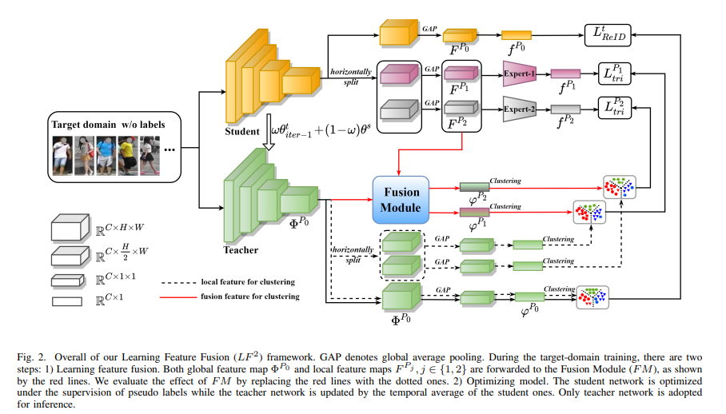
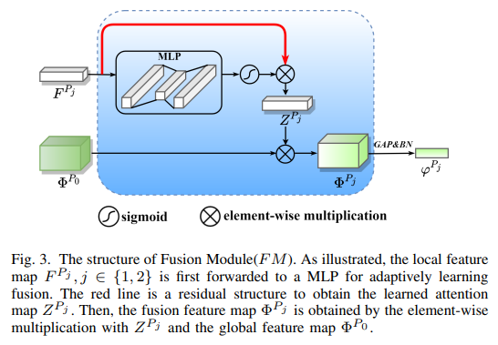
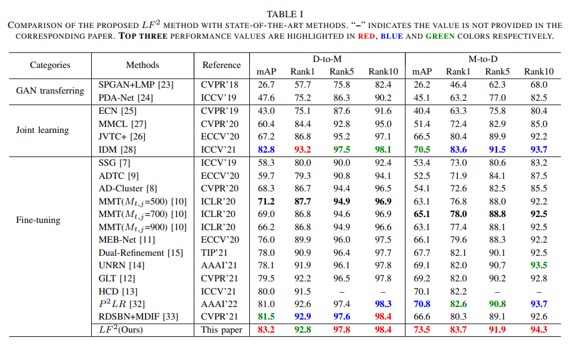

# Learning Feature Fusion for Unsupervised Domain Adaptive Person Re-identification
[news!]
[2022.7.27] Our paper is accepted by ICPR2022 oral ! [URL](https://ieeexplore.ieee.org/document/9956264)

<div align="center">
      
</div>
<div align="center">
      
</div>

## Requirements

- Ubuntu 18.04
- gcc version 7.5.0
- Python 3.8.5
- Pytorch 1.8.1
- NVIDIA GPU : two GeForce RTX 2080Ti
- Anaconda 4.9.2
- CUDA 10.2

## Weights
Download the pre-training weights and fine-tuning weights in Baidu Netdisk：[lf2m](https://pan.baidu.com/s/12_KrtSOf_--Voverri8tkw).
## Running

### step 1 Source-domain pre-training
```python
# for example, duke-to-market
python source_pretrain.py -ds duke -dt market --data-dir PATH/TO/DATA --logs-dir PATH/TO/SAVE/CHECKPOINTS
```

### step 2 Target-domain fine-tuning

```python
# for example, duke-to-market
python target_train.py -dt market --data-dir PATH/TO/DATA --logs-dir PATH/TO/SAVE/CHECKPOINTS
```

### step 3 Evaluate in the target domain

```python
# for example, duke-to-market
python model_test.py -dt market --data-dir PATH/TO/DATA --resume PATH/TO/CHECKPOINTS
```


## Experiments

<div align="center">
      
</div>


## Acknowledgement

Our code is based on [open-reid](https://github.com/Cysu/open-reid) and [MEB-Net](https://github.com/YunpengZhai/MEB-Net). 


